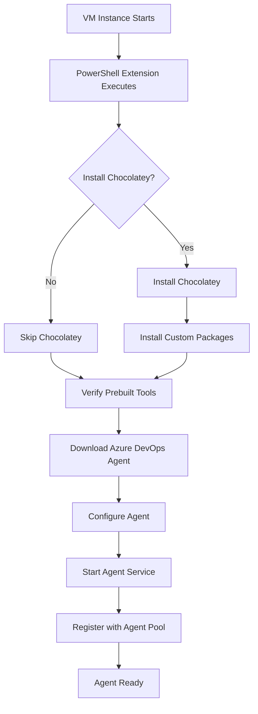

# Architecture Guide - Azure DevOps VMSS with Microsoft Prebuilt Images

This document provides a comprehensive overview of the architecture, design decisions, and technical implementation details for the Azure DevOps VMSS template with Microsoft prebuilt images and vWAN integration.

## 🏗️ Architecture Overview

### High-Level Architecture

```
┌─────────────────────────────────────────────────────────────────────────────┐
│                           Azure Cloud Environment                          │
├─────────────────────────────────────────────────────────────────────────────┤
│                                                                             │
│  ┌─────────────────────────────────────────────────────────────────────┐    │
│  │                    vWAN + Azure Firewall Hub                       │    │
│  │                   (Existing Infrastructure)                        │    │
│  │  ┌─────────────────┐  ┌─────────────────┐  ┌─────────────────┐    │    │
│  │  │   Azure         │  │   Route         │  │   DNS           │    │    │
│  │  │   Firewall      │  │   Tables        │  │   Resolution    │    │    │
│  │  └─────────────────┘  └─────────────────┘  └─────────────────┘    │    │
│  └─────────────────────────┬───────────────────────────────────────────┘    │
│                            │ Secure Connectivity                            │
│                            │                                                │
│  ┌─────────────────────────▼───────────────────────────────────────────┐    │
│  │                  DevOps Resource Group                             │    │
│  │                                                                     │    │
│  │  ┌─────────────────┐  ┌─────────────────┐  ┌─────────────────┐    │    │
│  │  │   Virtual       │  │   Network       │  │   Load          │    │    │
│  │  │   Network       │  │   Security      │  │   Balancer      │    │    │
│  │  │   (Private)     │  │   Group         │  │   (Internal)    │    │    │
│  │  └─────────────────┘  └─────────────────┘  └─────────────────┘    │    │
│  │                                                                     │    │
│  │  ┌─────────────────────────────────────────────────────────────┐    │    │
│  │  │                VM Scale Set                                 │    │    │
│  │  │                                                             │    │    │
│  │  │  ┌─────────────┐  ┌─────────────┐  ┌─────────────┐        │    │    │
│  │  │  │   VM 1      │  │   VM 2      │  │   VM N      │        │    │    │
│  │  │  │             │  │             │  │             │        │    │    │
│  │  │  │ Microsoft   │  │ Microsoft   │  │ Microsoft   │        │    │    │
│  │  │  │ Prebuilt    │  │ Prebuilt    │  │ Prebuilt    │        │    │    │
│  │  │  │ Image:      │  │ Image:      │  │ Image:      │        │    │    │
│  │  │  │ • VS 2022   │  │ • VS 2022   │  │ • VS 2022   │        │    │    │
│  │  │  │ • .NET SDKs │  │ • .NET SDKs │  │ • .NET SDKs │        │    │    │
│  │  │  │ • Azure CLI │  │ • Azure CLI │  │ • Azure CLI │        │    │    │
│  │  │  │ • Git       │  │ • Git       │  │ • Git       │        │    │    │
│  │  │  │             │  │             │  │             │        │    │    │
│  │  │  │ + DevOps    │  │ + DevOps    │  │ + DevOps    │        │    │    │
│  │  │  │   Agent     │  │   Agent     │  │   Agent     │        │    │    │
│  │  │  │ + Chocolatey│  │ + Chocolatey│  │ + Chocolatey│        │    │    │
│  │  │  │   Packages  │  │   Packages  │  │   Packages  │        │    │    │
│  │  │  └─────────────┘  └─────────────┘  └─────────────┘        │    │    │
│  │  └─────────────────────────────────────────────────────────────┘    │    │
│  │                                                                     │    │
│  │  ┌─────────────────┐  ┌─────────────────┐  ┌─────────────────┐    │    │
│  │  │   Auto Scale    │  │   Azure         │  │   Key Vault     │    │    │
│  │  │   Settings      │  │   Monitor       │  │   (Secrets)     │    │    │
│  │  └─────────────────┘  └─────────────────┘  └─────────────────┘    │    │
│  └─────────────────────────────────────────────────────────────────┘    │
│                                                                             │
│  ┌─────────────────────────────────────────────────────────────────────┐    │
│  │                     Azure DevOps Services                          │    │
│  │  ┌─────────────────┐  ┌─────────────────┐  ┌─────────────────┐    │    │
│  │  │   Agent         │  │   Build         │  │   Artifact      │    │    │
│  │  │   Pools         │  │   Pipelines     │  │   Storage       │    │    │
│  │  └─────────────────┘  └─────────────────┘  └─────────────────┘    │    │
│  └─────────────────────────────────────────────────────────────────────┘    │
└─────────────────────────────────────────────────────────────────────────────┘
```

## 🔒 Security Architecture

### Zero Trust Network Model

The template implements a zero trust network architecture with the following principles:

#### 1. Private IP Only Configuration
```bicep
// No public IP addresses assigned to VMSS instances
publicIPAddressConfiguration: null

// All communication through private networks
ipConfigurations: [
  {
    name: 'ipconfig1'
    properties: {
      subnet: {
        id: subnetId
      }
      privateIPAddressVersion: 'IPv4'
      privateIPAllocationMethod: 'Dynamic'
    }
  }
]
```

#### 2. Network Security Groups (NSG)
```bicep
// Restrictive NSG rules - VirtualNetwork scope only
securityRules: [
  {
    name: 'AllowVnetInbound'
    properties: {
      priority: 1000
      protocol: '*'
      access: 'Allow'
      direction: 'Inbound'
      sourceAddressPrefix: 'VirtualNetwork'
      destinationAddressPrefix: 'VirtualNetwork'
      sourcePortRange: '*'
      destinationPortRange: '*'
    }
  }
  {
    name: 'AllowAzureLoadBalancerInbound'
    properties: {
      priority: 1001
      protocol: '*'
      access: 'Allow'
      direction: 'Inbound'
      sourceAddressPrefix: 'AzureLoadBalancer'
      destinationAddressPrefix: '*'
      sourcePortRange: '*'
      destinationPortRange: '*'
    }
  }
  {
    name: 'DenyAllInbound'
    properties: {
      priority: 4096
      protocol: '*'
      access: 'Deny'
      direction: 'Inbound'
      sourceAddressPrefix: '*'
      destinationAddressPrefix: '*'
      sourcePortRange: '*'
      destinationPortRange: '*'
    }
  }
]
```

#### 3. vWAN Integration
- **Centralized Connectivity**: All outbound traffic routes through Azure Firewall in vWAN hub
- **Secure Internet Access**: Azure Firewall provides controlled outbound connectivity
- **Network Segmentation**: DevOps workloads isolated in dedicated spoke network
- **Centralized Monitoring**: All network traffic logged and monitored centrally

### Identity and Access Management

#### 1. Managed Identity Integration
```bicep
identity: {
  type: 'SystemAssigned'
}
```

#### 2. Key Vault Integration
```bicep
// Secure secret management
keyVaultSecrets: [
  {
    name: 'adminPassword'
    value: adminPassword
  }
  {
    name: 'azureDevOpsPat'
    value: azureDevOpsPat
  }
]
```

#### 3. Role-Based Access Control (RBAC)
- **Principle of Least Privilege**: Minimal permissions for VMSS instances
- **Service Principal Authentication**: Secure Azure DevOps integration
- **Resource-Level Permissions**: Granular access control

## 🖥️ Compute Architecture

### Microsoft Prebuilt Images

#### Image Selection Matrix

| Image Type | Publisher | Offer | SKU | Use Case | VM Size |
|------------|-----------|-------|-----|----------|---------|
| VS 2022 Enterprise | MicrosoftVisualStudio | visualstudio2022 | vs-2022-ent-latest-ws2022 | Full Development | D4s_v3+ |
| VS 2022 Build Tools | MicrosoftVisualStudio | visualstudio2022 | vs-2022-buildtools-latest-ws2022 | CI/CD Builds | D2s_v3+ |
| VS 2019 Enterprise | MicrosoftVisualStudio | visualstudio2019 | vs-2019-ent-latest-ws2019 | Legacy Projects | D4s_v3+ |
| Windows Server 2022 | MicrosoftWindowsServer | WindowsServer | 2022-datacenter-azure-edition | Custom Tooling | D2s_v3+ |

#### Image Configuration Logic
```bicep
var imageConfigurations = {
  'vs2022-enterprise': {
    publisher: 'MicrosoftVisualStudio'
    offer: 'visualstudio2022'
    sku: 'vs-2022-ent-latest-ws2022'
    version: 'latest'
  }
  'vs2022-buildtools': {
    publisher: 'MicrosoftVisualStudio'
    offer: 'visualstudio2022'
    sku: 'vs-2022-buildtools-latest-ws2022'
    version: 'latest'
  }
  'vs2019-enterprise': {
    publisher: 'MicrosoftVisualStudio'
    offer: 'visualstudio2019'
    sku: 'vs-2019-ent-latest-ws2019'
    version: 'latest'
  }
  'windowsserver-2022': {
    publisher: 'MicrosoftWindowsServer'
    offer: 'WindowsServer'
    sku: '2022-datacenter-azure-edition'
    version: 'latest'
  }
}
```

### VM Scale Set Configuration

#### 1. Scaling Configuration
```bicep
sku: {
  name: vmSize
  tier: 'Standard'
  capacity: instanceCount
}

// Auto-scaling settings
autoscaleSettings: {
  enabled: true
  profiles: [
    {
      name: 'defaultProfile'
      capacity: {
        minimum: '1'
        maximum: '100'
        default: string(instanceCount)
      }
      rules: [
        {
          metricTrigger: {
            metricName: 'Percentage CPU'
            metricNamespace: 'Microsoft.Compute/virtualMachineScaleSets'
            metricResourceUri: vmssId
            operator: 'GreaterThan'
            statistic: 'Average'
            threshold: 75
            timeAggregation: 'Average'
            timeGrain: 'PT1M'
            timeWindow: 'PT5M'
          }
          scaleAction: {
            direction: 'Increase'
            type: 'ChangeCount'
            value: '1'
            cooldown: 'PT5M'
          }
        }
        {
          metricTrigger: {
            metricName: 'Percentage CPU'
            metricNamespace: 'Microsoft.Compute/virtualMachineScaleSets'
            metricResourceUri: vmssId
            operator: 'LessThan'
            statistic: 'Average'
            threshold: 25
            timeAggregation: 'Average'
            timeGrain: 'PT1M'
            timeWindow: 'PT10M'
          }
          scaleAction: {
            direction: 'Decrease'
            type: 'ChangeCount'
            value: '1'
            cooldown: 'PT10M'
          }
        }
      ]
    }
  ]
}
```

#### 2. Storage Configuration
```bicep
storageProfile: {
  osDisk: {
    createOption: 'FromImage'
    caching: 'ReadWrite'
    managedDisk: {
      storageAccountType: 'Premium_LRS'
    }
    diskSizeGB: 128
  }
  imageReference: imageConfigurations[microsoftImageType]
}
```

#### 3. Network Profile
```bicep
networkProfile: {
  networkInterfaceConfigurations: [
    {
      name: 'nicConfig'
      properties: {
        primary: true
        networkSecurityGroup: {
          id: nsgId
        }
        ipConfigurations: [
          {
            name: 'ipconfig1'
            properties: {
              subnet: {
                id: subnetId
              }
              privateIPAddressVersion: 'IPv4'
              privateIPAllocationMethod: 'Dynamic'
              loadBalancerBackendAddressPools: [
                {
                  id: loadBalancerBackendPoolId
                }
              ]
            }
          }
        ]
      }
    }
  ]
}
```

## 🌐 Network Architecture

### Network Topology

#### 1. Virtual Network Design
```bicep
// Hub-spoke topology with vWAN integration
virtualNetwork: {
  addressSpace: {
    addressPrefixes: [vnetAddressPrefix] // e.g., '10.0.0.0/16'
  }
  subnets: [
    {
      name: subnetName
      properties: {
        addressPrefix: subnetAddressPrefix // e.g., '10.0.1.0/24'
        networkSecurityGroup: {
          id: nsgId
        }
        routeTable: {
          id: routeTableId // Routes to Azure Firewall
        }
      }
    }
  ]
}
```

#### 2. Load Balancer Configuration
```bicep
// Internal load balancer for health probes
loadBalancer: {
  sku: {
    name: 'Standard'
    tier: 'Regional'
  }
  properties: {
    frontendIPConfigurations: [
      {
        name: 'LoadBalancerFrontEnd'
        properties: {
          privateIPAllocationMethod: 'Dynamic'
          subnet: {
            id: subnetId
          }
        }
      }
    ]
    backendAddressPools: [
      {
        name: 'BackendPool'
      }
    ]
    probes: [
      {
        name: 'HealthProbe'
        properties: {
          protocol: 'Tcp'
          port: 80
          intervalInSeconds: 15
          numberOfProbes: 2
        }
      }
    ]
  }
}
```

#### 3. Route Table Configuration
```bicep
// Route all traffic through Azure Firewall
routeTable: {
  routes: [
    {
      name: 'DefaultRoute'
      properties: {
        addressPrefix: '0.0.0.0/0'
        nextHopType: 'VirtualAppliance'
        nextHopIpAddress: azureFirewallPrivateIP
      }
    }
    {
      name: 'VnetLocal'
      properties: {
        addressPrefix: vnetAddressPrefix
        nextHopType: 'VnetLocal'
      }
    }
  ]
}
```

### Network Security

#### 1. Azure Firewall Rules (Required)
```json
{
  "applicationRules": [
    {
      "name": "AllowAzureDevOps",
      "protocols": [
        {
          "protocolType": "Https",
          "port": 443
        }
      ],
      "targetFqdns": [
        "*.dev.azure.com",
        "*.visualstudio.com",
        "vstsagentpackage.azureedge.net",
        "login.microsoftonline.com"
      ],
      "sourceAddresses": ["10.0.1.0/24"]
    },
    {
      "name": "AllowChocolatey",
      "protocols": [
        {
          "protocolType": "Https",
          "port": 443
        }
      ],
      "targetFqdns": [
        "community.chocolatey.org",
        "chocolatey.org",
        "packages.chocolatey.org"
      ],
      "sourceAddresses": ["10.0.1.0/24"]
    }
  ]
}
```

#### 2. Network Security Group Rules
```bicep
securityRules: [
  // Allow inbound from VNet only
  {
    name: 'AllowVnetInbound'
    properties: {
      priority: 1000
      protocol: '*'
      access: 'Allow'
      direction: 'Inbound'
      sourceAddressPrefix: 'VirtualNetwork'
      destinationAddressPrefix: 'VirtualNetwork'
      sourcePortRange: '*'
      destinationPortRange: '*'
    }
  }
  // Allow outbound to Internet (controlled by Azure Firewall)
  {
    name: 'AllowInternetOutbound'
    properties: {
      priority: 1000
      protocol: '*'
      access: 'Allow'
      direction: 'Outbound'
      sourceAddressPrefix: 'VirtualNetwork'
      destinationAddressPrefix: 'Internet'
      sourcePortRange: '*'
      destinationPortRange: '*'
    }
  }
]
```

## 🔧 Configuration Management

### PowerShell Extension Architecture

#### 1. Extension Configuration
```bicep
extensionProfile: {
  extensions: [
    {
      name: 'ConfigureDevOpsAgent'
      properties: {
        publisher: 'Microsoft.Compute'
        type: 'CustomScriptExtension'
        typeHandlerVersion: '1.10'
        autoUpgradeMinorVersion: true
        settings: {
          fileUris: [
            '${_artifactsLocation}/scripts/configure-devops-agent.ps1${_artifactsLocationSasToken}'
          ]
        }
        protectedSettings: {
          commandToExecute: 'powershell -ExecutionPolicy Unrestricted -File configure-devops-agent.ps1 -AzureDevOpsUrl "${azureDevOpsUrl}" -PersonalAccessToken "${azureDevOpsPat}" -AgentPool "${agentPoolName}" -AgentName "BuildAgent" -ChocoPackages @("${join(chocoPackages, '","')}") -InstallChocolatey $${installChocolatey}'
        }
      }
    }
  ]
}
```

#### 2. Script Execution Flow


### Chocolatey Integration

#### 1. Package Management Strategy
```powershell
# Conditional Chocolatey installation
if ($InstallChocolatey) {
    # Install Chocolatey
    Set-ExecutionPolicy Bypass -Scope Process -Force
    [System.Net.ServicePointManager]::SecurityProtocol = [System.Net.ServicePointManager]::SecurityProtocol -bor 3072
    iex ((New-Object System.Net.WebClient).DownloadString('https://community.chocolatey.org/install.ps1'))
    
    # Install packages with version control
    foreach ($package in $ChocoPackages) {
        $installArgs = @("install", $package, "-y", "--no-progress")
        if ($ChocoPackageParams.ContainsKey($package)) {
            $installArgs += $ChocoPackageParams[$package].Split(' ')
        }
        & choco @installArgs
    }
}
```

#### 2. Package Configuration Examples
```json
{
  "chocoPackages": [
    "nodejs",
    "python",
    "docker-desktop",
    "terraform",
    "kubernetes-cli",
    "azure-cli"
  ],
  "chocoPackageParams": {
    "nodejs": "--version=18.17.0",
    "python": "--version=3.11.0",
    "terraform": "--version=1.5.0"
  }
}
```

## 📊 Monitoring and Observability

### Azure Monitor Integration

#### 1. Metrics Collection
```bicep
// Enable detailed monitoring
diagnosticSettings: {
  name: 'vmss-diagnostics'
  properties: {
    workspaceId: logAnalyticsWorkspaceId
    metrics: [
      {
        category: 'AllMetrics'
        enabled: true
        retentionPolicy: {
          enabled: true
          days: 30
        }
      }
    ]
    logs: [
      {
        category: 'Administrative'
        enabled: true
        retentionPolicy: {
          enabled: true
          days: 30
        }
      }
    ]
  }
}
```

#### 2. Key Performance Indicators (KPIs)
- **Agent Availability**: Percentage of agents online and ready
- **Build Queue Time**: Time builds wait for available agents
- **Resource Utilization**: CPU, memory, and disk usage across instances
- **Scaling Events**: Auto-scale operations and their triggers
- **Network Performance**: Latency and throughput to Azure DevOps services

#### 3. Alerting Strategy
```bicep
// Critical alerts
alerts: [
  {
    name: 'HighCPUUsage'
    condition: 'avg Percentage CPU > 85'
    severity: 'Warning'
    frequency: 'PT5M'
  }
  {
    name: 'LowAgentAvailability'
    condition: 'count agents < 1'
    severity: 'Critical'
    frequency: 'PT1M'
  }
  {
    name: 'ScalingFailure'
    condition: 'scaling operation failed'
    severity: 'Error'
    frequency: 'PT1M'
  }
]
```

## 🔄 Deployment Architecture

### Infrastructure as Code (IaC) Strategy

#### 1. Bicep Template Structure
```
bicep/
├── vmss-infrastructure.bicep      # Main template
├── parameters.json                # Default parameters
├── modules/
│   ├── network.bicep             # Network resources
│   ├── security.bicep            # Security configurations
│   ├── compute.bicep             # VMSS and related resources
│   └── monitoring.bicep          # Monitoring and alerting
└── scripts/
    └── configure-devops-agent.ps1 # Agent configuration script
```

#### 2. Parameter Management
```bicep
// Environment-specific parameters
@description('Environment-specific configuration')
param environmentConfig object = {
  development: {
    vmSize: 'Standard_D2s_v3'
    instanceCount: 1
    autoScaleEnabled: false
  }
  staging: {
    vmSize: 'Standard_D2s_v3'
    instanceCount: 2
    autoScaleEnabled: true
  }
  production: {
    vmSize: 'Standard_D4s_v3'
    instanceCount: 3
    autoScaleEnabled: true
  }
}
```

#### 3. Deployment Pipeline
```yaml
# Azure DevOps Pipeline
stages:
- stage: Validate
  jobs:
  - job: ValidateTemplate
    steps:
    - task: AzureCLI@2
      inputs:
        scriptType: 'bash'
        scriptLocation: 'inlineScript'
        inlineScript: |
          az deployment group validate \
            --resource-group $(resourceGroupName) \
            --template-file bicep/vmss-infrastructure.bicep \
            --parameters @bicep/parameters-$(environment).json

- stage: Deploy
  dependsOn: Validate
  jobs:
  - deployment: DeployInfrastructure
    environment: $(environment)
    strategy:
      runOnce:
        deploy:
          steps:
          - task: AzureCLI@2
            inputs:
              scriptType: 'bash'
              scriptLocation: 'inlineScript'
              inlineScript: |
                az deployment group create \
                  --resource-group $(resourceGroupName) \
                  --template-file bicep/vmss-infrastructure.bicep \
                  --parameters @bicep/parameters-$(environment).json \
                  --parameters adminPassword="$(adminPassword)" \
                  --parameters azureDevOpsPat="$(azureDevOpsPat)"
```

## 🔧 Extensibility and Customization

### Template Customization Points

#### 1. Image Selection
```bicep
// Add custom image types
var imageConfigurations = {
  // ... existing configurations
  'custom-dotnet': {
    publisher: 'YourPublisher'
    offer: 'YourOffer'
    sku: 'YourSKU'
    version: 'latest'
  }
}
```

#### 2. Network Integration
```bicep
// Support for different network topologies
param networkTopology string = 'vwan' // 'vwan', 'hub-spoke', 'standalone'

var networkConfigurations = {
  vwan: {
    useExistingVnet: true
    routeToFirewall: true
    publicIPEnabled: false
  }
  'hub-spoke': {
    useExistingVnet: true
    routeToFirewall: false
    publicIPEnabled: false
  }
  standalone: {
    useExistingVnet: false
    routeToFirewall: false
    publicIPEnabled: true
  }
}
```

#### 3. Custom Extensions
```bicep
// Support for additional VM extensions
param additionalExtensions array = []

var allExtensions = concat([
  {
    name: 'ConfigureDevOpsAgent'
    // ... configuration
  }
], additionalExtensions)
```

### Integration Patterns

#### 1. CI/CD Integration
- **Azure DevOps Pipelines**: Native integration with agent pools
- **GitHub Actions**: Support for self-hosted runners
- **Jenkins**: Agent configuration for Jenkins builds
- **GitLab CI**: Custom runner registration

#### 2. Monitoring Integration
- **Azure Monitor**: Native metrics and logs
- **Application Insights**: Application performance monitoring
- **Prometheus/Grafana**: Custom metrics collection
- **Splunk**: Log aggregation and analysis

#### 3. Security Integration
- **Azure Security Center**: Security posture management
- **Azure Sentinel**: Security information and event management
- **Key Vault**: Secrets and certificate management
- **Azure AD**: Identity and access management

## 📈 Performance Optimization

### Scaling Strategies

#### 1. Predictive Scaling
```bicep
// Schedule-based scaling for known patterns
scheduleBasedScaling: {
  profiles: [
    {
      name: 'BusinessHours'
      capacity: {
        minimum: '3'
        maximum: '10'
        default: '5'
      }
      recurrence: {
        frequency: 'Week'
        schedule: {
          timeZone: 'Pacific Standard Time'
          days: ['Monday', 'Tuesday', 'Wednesday', 'Thursday', 'Friday']
          hours: [8]
          minutes: [0]
        }
      }
    }
    {
      name: 'OffHours'
      capacity: {
        minimum: '1'
        maximum: '3'
        default: '1'
      }
      recurrence: {
        frequency: 'Week'
        schedule: {
          timeZone: 'Pacific Standard Time'
          days: ['Monday', 'Tuesday', 'Wednesday', 'Thursday', 'Friday']
          hours: [18]
          minutes: [0]
        }
      }
    }
  ]
}
```

#### 2. Custom Metrics Scaling
```bicep
// Scale based on Azure DevOps queue depth
customMetricScaling: {
  metricTrigger: {
    metricName: 'QueueLength'
    metricNamespace: 'AzureDevOps/AgentPools'
    operator: 'GreaterThan'
    threshold: 5
    statistic: 'Average'
    timeWindow: 'PT2M'
  }
  scaleAction: {
    direction: 'Increase'
    type: 'ChangeCount'
    value: '2'
    cooldown: 'PT3M'
  }
}
```

### Cost Optimization

#### 1. Spot Instance Integration
```bicep
// Use spot instances for non-critical workloads
spotInstanceConfiguration: {
  evictionPolicy: 'Deallocate'
  maxPrice: 0.05 // Maximum price per hour
}
```

#### 2. Reserved Instance Planning
```bicep
// Calculate reserved instance recommendations
reservedInstanceAnalysis: {
  baselineInstances: 2 // Always-on instances
  peakInstances: 10 // Maximum instances
  utilizationPattern: 'BusinessHours' // Usage pattern
  recommendedReservation: 3 // Recommended RI count
}
```

## 🔮 Future Enhancements

### Planned Features

1. **Multi-Region Support**: Deploy agents across multiple Azure regions
2. **GPU Support**: Support for GPU-enabled VM sizes for specialized workloads
3. **Container Integration**: Support for containerized build agents
4. **Advanced Monitoring**: Integration with Azure Monitor Workbooks
5. **Cost Analytics**: Detailed cost tracking and optimization recommendations

### Extensibility Roadmap

1. **Plugin Architecture**: Support for custom plugins and extensions
2. **Template Marketplace**: Community-contributed templates and configurations
3. **Advanced Networking**: Support for Azure Virtual WAN 2.0 features
4. **Security Enhancements**: Integration with Azure Defender and advanced threat protection
5. **Compliance**: Built-in compliance templates for various standards (SOC 2, ISO 27001, etc.)

---

This architecture guide provides a comprehensive overview of the technical implementation and design decisions. For specific implementation details, refer to the Bicep templates and PowerShell scripts in the repository.

